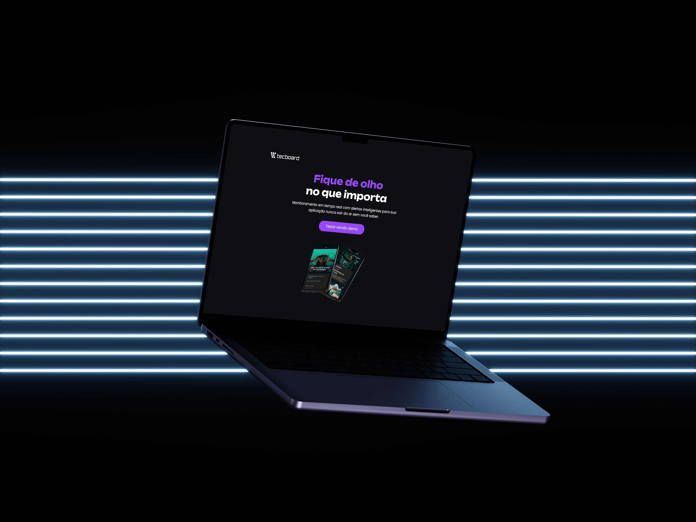

# Tecboard

Página de links desenvolvida durante o curso de Front-End da Alura.



## 💻  Sobre o projeto

O Tecboard é uma página de links com design moderno e escuro, desenvolvida para reunir e organizar links em um só lugar de forma visualmente atraente.

## 🚀  Tecnologias

- HTML5
- CSS3

## 🔖 Como visualizar

1. Clone o repositório:
   ```bash
   git clone https://github.com/letyciaoliveirag/tecboard.git
   ```
2. Abra o arquivo `index.html` no navegador

## 👩‍💻 Autora

Feito por [Letycia Oliveira](https://github.com/letyciaoliveirag)

---

Projeto desenvolvido durante aula, com orientação da professora.
